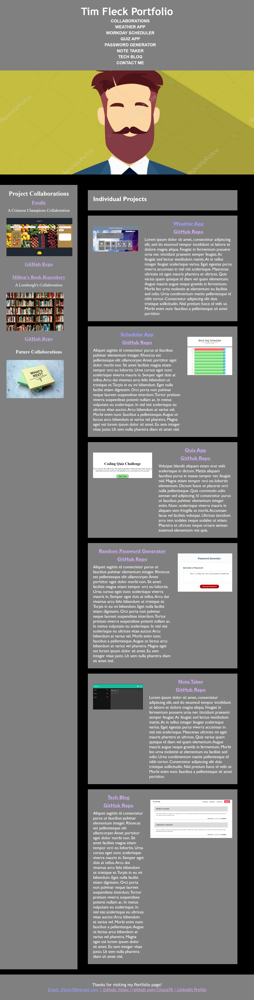

# <Mini-Project-02-Webpage>

## Description

This website is designed to show my proficiency in building code from scratch to satisfy the user story and acceptance criteria. The portfolio showcased in this website will eventually link all of my collaborative and individual work as a programmer to perspective employers.

## Installation

N/A

## Usage

The external URL for this portfolio is: https://chuca78.github.io/Portfolio/

## Credits

N/A

## License

Please refer to the MIT LICENSE in this repo.

## Badges

## How to Contribute

Tim Fleck 
Full-Stack Developer 
[CHUCA78](https://github.com/Chuca78)  
t.fleck@hotmail.com

## Copyright

Copyright 2022 Tim Fleck
